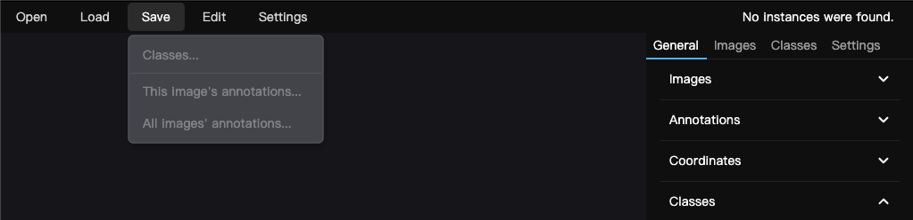
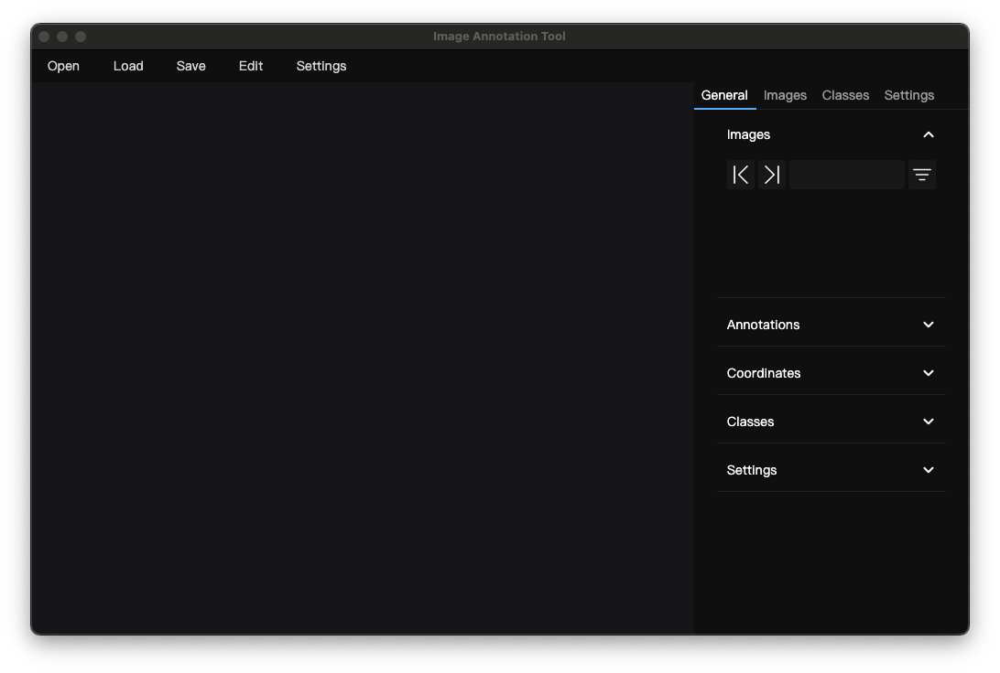
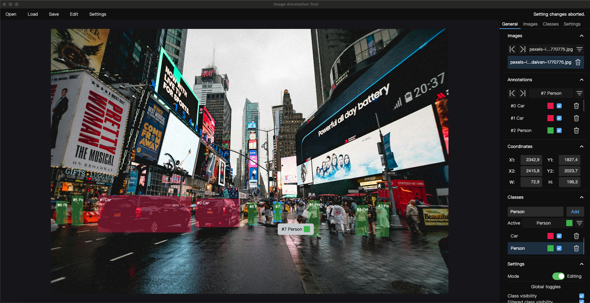
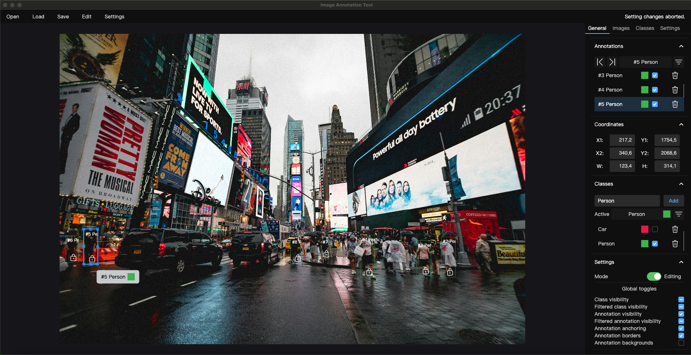
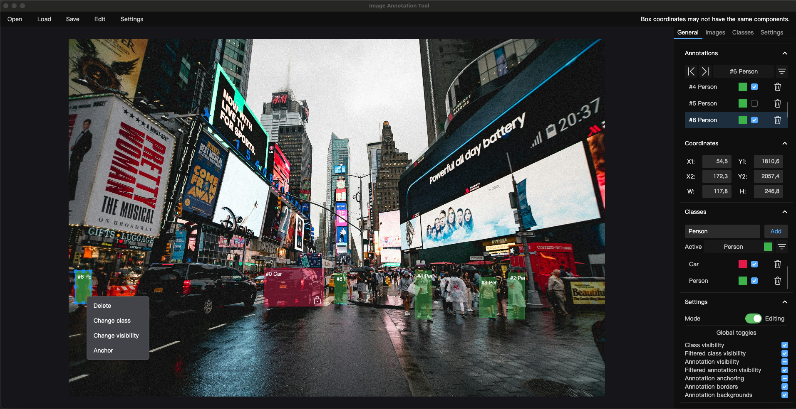
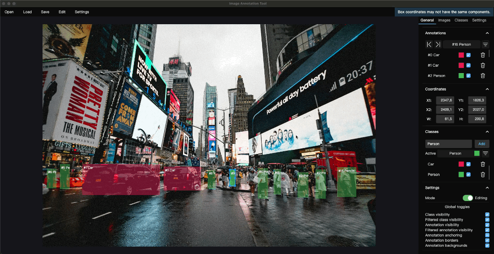
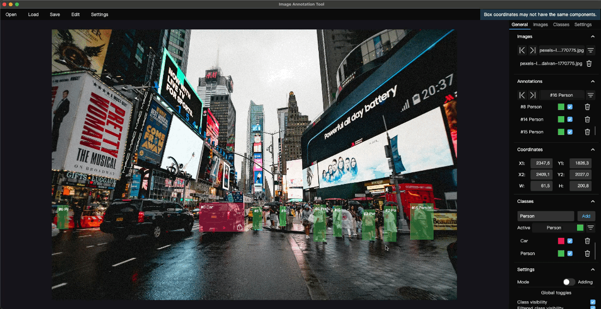

# Image Annotation Tool

## Table of contents

<!-- TOC -->
* [Overview](#overview)
* [Interface](#interface)
* [Features](#features)
* [Upcoming features](#upcoming-features)
* [Disclaimer](#disclaimer)
* [UI walkthrough](#ui-walkthrough)
* [Technical details](#technical-details)
* [Showcase](#showcase)
<!-- TOC -->

## Overview
A simple desktop image annotation tool for rapid bounding box-based 
object detection dataset building.

The tool aims to provide a simple and straightforward approach to 
creation and manipulation of annotations in the form of bounding boxes.

#### [Jump to introduction](#ui-walkthrough) 

## Interface

The tool implements a tab-based user interface for easy navigation of
open images, existing annotations and available classes,
all of which can be filtered and sorted.

Annotations can be manipulated
both on-image and from within their designated UI regions.

## Features
Currently, the tool comprises the following features:

- Two modes of annotation drawing:  
  - click-to-click drawing,
  - drag drawing.

- Operations involving annotations:
  - spatial: resizing and moving,
  - state: swapping assigned class, anchoring, toggling visibility.

- Operations involving classes:
  - creation and deletion of user defined classes, 
  - instance swapping and deletion, both globally and within active image,
  - visibility toggling,
  - renaming.

- Undoing/redoing of state-mutating operations, via keyboard shortcuts and the UI.

- Customizable rendering settings, revolving around annotation displaying.

## Upcoming features

Most notably, the coming features will include:

- Automatic annotation via neural network inference.
- Customizable hotkey bindings for more streamlined experience.
- Extended loading functionalities, including video parsing and dataset loading.
- UI polishing, both visual and mechanical.

## Disclaimer
##### **The tool is currently functionally incomplete, as it doesn't allow any form of saving.**

This prerelease hence serves the purpose of a showcase
(opening images, as well as simple,
newline-separated .txt class list files, are supported).

Next release is set to feature preservation of both user settings,
and annotation saving.

## UI walkthrough

The UI consists of three major, distinct parts: topbar, sidebar and workspace.

### Topbar
Contains IO management buttons (_Open_, _Save_, _Load_), 
settings and some editing options, much akin to what any desktop application has.
The rightmost part of the topbar, directly above the sidebar, is used to display
feedback about user operations.

### Sidebar
Contains four tabs: _General_, _Images_, _Classes_ and _Settings_.

### General tab
Consists of five sections: one for each of the remaining tabs, 
one contained within _Images_ tab (_Annotations_), and one for last
drawn/selected annotation's coordinates.

### Images tab
Contains a list of open images, as well as a list of annotations 
associated with the currently selected image.

### Classes tab
Contains a list of classes, as well as means of manually adding new ones.

### Settings tab
Comprises mode switching (adding/editing) together with 
convenience tool settings, mainly regarding rendering of annotations and classes.

## Showcase

### [Screenshots](#screenshots-1)
### [GIFs](#gifs-1)

Image used for showcasing examples:
https://www.pexels.com/photo/people-at-times-square-new-york-1770775/

## Technical details

**Note: the tool implementation may be subject to change, and so may the details.**

The tool's architecture was designed with MVVM principles in mind. 
To better accomodate for the stateful nature of annotations, 
and especially the annotation – class relationship, 
the tool was equipped with a "DDD" layer 
(very loosely adhering to principles imposed therein due 
to non-critical data handling, thus in quotes).

The tool was created using Avalonia framework, 
enabling it to run on Windows, Linux and macOS machines. 
**It should be noted that this wasn't tested in any meaningful way.** 

Presently, the tool makes extensive use of the following packages:

- CommunityToolkit.Mvvm by the Community Toolkit organization
  - https://github.com/CommunityToolkit/dotnet

- PanAndZoom by wieslawsoltes
  - https://github.com/wieslawsoltes/PanAndZoom
  

- Xaml.Behaviors by wieslawsoltes
  - https://github.com/wieslawsoltes/Xaml.Behaviors

- DialogHost by AvaloniaUtils
  - https://github.com/AvaloniaUtils/DialogHost.Avalonia

- HanumanInstitute.MvvmDialogs by mysteryx93
  - https://github.com/mysteryx93/HanumanInstitute.MvvmDialogs

- Ursa.Avalonia by IRIHI Technology
  - https://github.com/irihitech/Ursa.Avalonia

- FluentAvalonia by amwx
  - https://github.com/amwx/FluentAvalonia

## Screenshots

## GIFs

